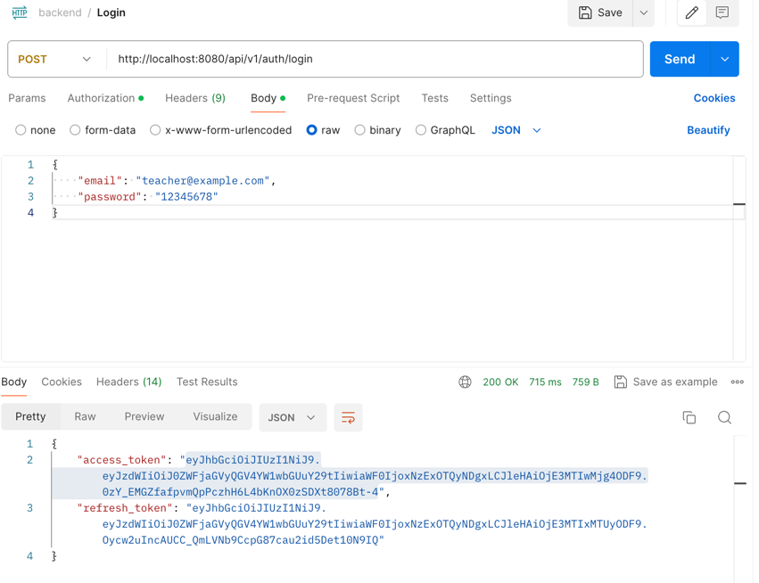

thực hiện login thành công

tạo user

kết quả tạo user

update user

kết quả update user

delete user

kết qủa delete user

tạo bài kiểm tra

kết quả tạo bài kiểm tra

update bài kiểm tra

kết quả update bài kiểm tra

xoá bài kiểm tra

đăng nhập

đăng xuất

kết quả đăng xuất
